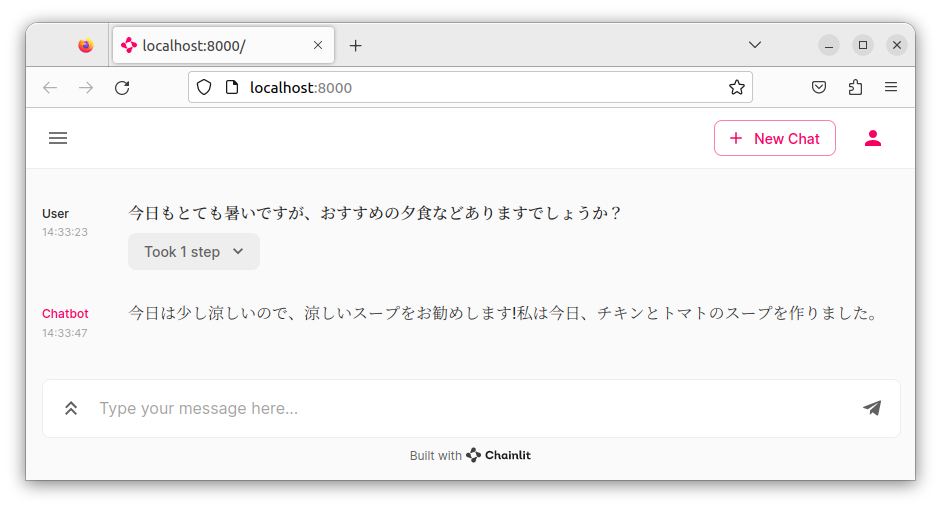

# LoRA instruction tuning script for Japanese Language models.

| models                   | tested platform                              |
|--------------------------|----------------------------------------------|
| rinna gptneox            | jetson agx orin                              |
| cyberagent opencalm      | jetson agx orin                              |
| meta llama2              | jetson agx orin (70B not work need more VRAM) |
| line-corporation gptneox | jetson agx orin                              |
| stabilityai stablelm     | jetson agx orin                              |
| matsuo-lab gptneox       | jetson agx orin                              |

**finetune**

```bash
nohup python3 lora_finetune.py --model_name="HUGGINGFACE_MODEL_NAME" > logging.out &
```

**test (example line-corporation/japanese-large-lm-3.6b dolly-15k-ja 1epoch)**

```bash
python3 lora_test.py --slow_tokenizer
:
赤、緑、青
日本で2番目に高い山は、北岳(3,193m)である。
紫式部は、物語や詩文に多くの女性的な要素を取り入れているのに対し、清少納言は、男性的で論理的な文章を多く残している
```

**merge**

```bash
python3 lora_merge.py 
:
ls final_merged_checkpoint/
config.json             special_tokens_map.json  tokenizer_config.json
generation_config.json  spiece.model
pytorch_model.bin       tokenizer.json
```

**convert ggml (gptneox)**

```bash
git clone https://github.com/ggerganov/ggml
cd ggml
mkdir build && cd build
cmake ..
make -j
python3 ../examples/gpt-neox/convert-h5-to-ggml.py /path/to/final_merged_checkpoint 1
```

**webui**

```bash
pip3 install ctransformers # or pip install git+https://github.com/marella/ctransformers.git
pip3 install chainlit
chainlit run app.py -w
```


## for jetson orin (on L4T R35.2.1):

**bitsandbytes**

```bash
git clone https://github.com/to-aoki/bitsandbytes.git
cd bitsandbytes
CUDA_VERSION=114 make cuda11x
python3 setup.py install
```

**text-generation-webui**

follow jetson (follow python 3.8)

```bash
git clone https://github.com/oobabooga/text-generation-webui
(... remove @functools.cache ...)
```