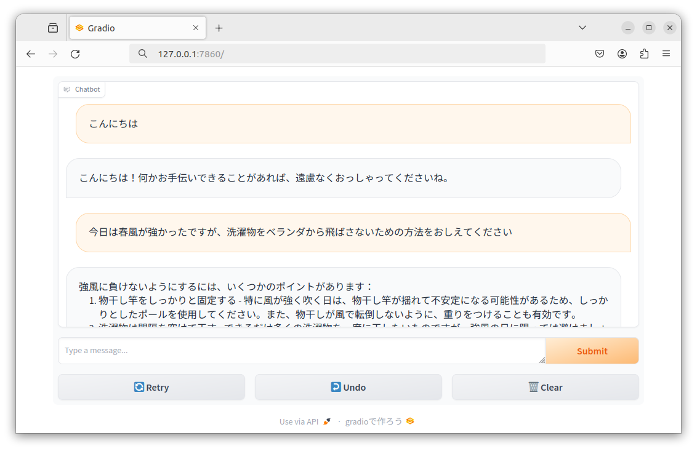

# LoRA instruction tuning script for Japanese Language models.

## Tested 
(maybe work on x86 too)

 - Hardware
  	+ [Jetson AGX Orin Developer Kit](https://www.nvidia.com/en-us/autonomous-machines/embedded-systems/jetson-orin/)

 - Software
  	+ [JetPack 6.0](https://developer.nvidia.com/embedded/jetpack-sdk-60)


| models                   | 
|--------------------------|
| rinna gptneox            |
| cyberagent opencalm      |
| meta llama2              |
| line-corporation gptneox |
| stabilityai stablelm     |
| llm-jp/FugakuLLM         |
| deepseek coder           |
| google gemma             |
| Swallow MS 7b v.01       |
| Swallow MX 8x7b NVE v.01 |
| Phi3-mini                |

**finetune**

```bash
nohup python3 lora_finetune.py --model_name="HUGGINGFACE_MODEL_NAME" > logging.out &
```

**test (example line-corporation/japanese-large-lm-3.6b dolly-15k-ja 1epoch)**

```bash
python3 lora_test.py --slow_tokenizer
:
赤、緑、青
日本で2番目に高い山は、北岳(3,193m)である。
紫式部は、物語や詩文に多くの女性的な要素を取り入れているのに対し、清少納言は、男性的で論理的な文章を多く残している
```

**merge**

```bash
python3 lora_merge.py 
:
ls final_merged_checkpoint/
config.json             special_tokens_map.json  tokenizer_config.json
generation_config.json  spiece.model
pytorch_model.bin       tokenizer.json
```

**webui**

```bash
python3 app.py 
```

